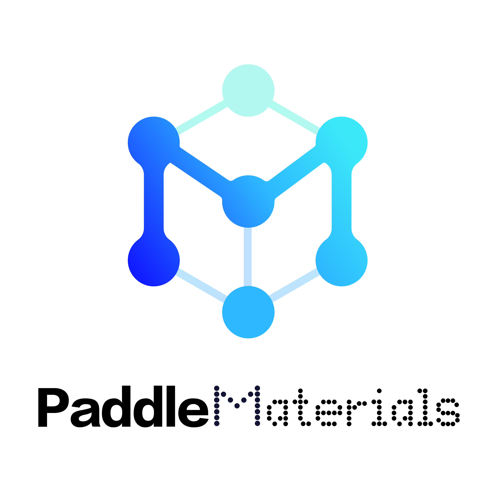
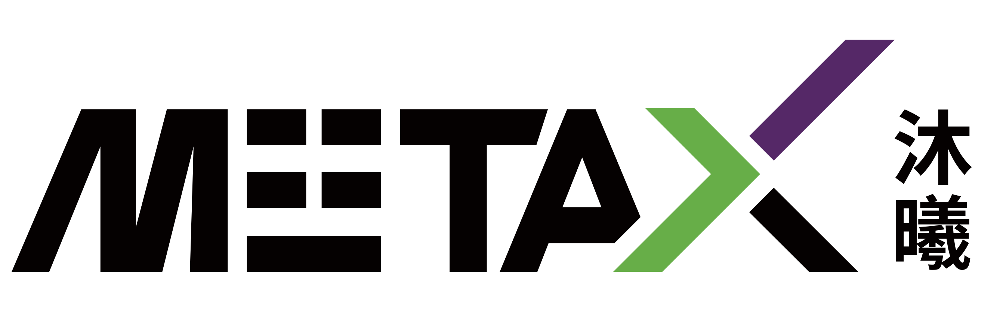

# PaddleMaterials

<p align="center">
 
<p align="center">

## 🚀 Introduction

**PaddleMaterials** is an end-to-end AI4Materials toolkit built on the **PaddlePaddle** deep learning framework. Designed as a data-mechanism dual-driven platform for developing and deploying foundation models in materials science, **PPMat** enables researchers to efficiently build AI models and accelerate material discovery using pretrained models.

<p align="left">
 
<p align="left">

### Core Capabilities

| Task | Description | Typical Applications |
|------|-------------|---------------------|
| **Property Prediction (PP)** | Predict material properties from structure | Formation energy, band gap, elastic moduli |
| **Structure Generation (SG)** | Generate novel crystal structures | High-throughput screening, inverse design |
| **Interatomic Potential (IP)** | Replace DFT with ML potentials | Molecular dynamics, large-scale simulations |
| **Electronic Structure (ES)** | Predict electronic properties | Band structure, density of states |
| **Spectrum Elucidation (SE)** | Reconstruct structures from spectra | NMR structure elucidation |

### Supported Materials

- **Inorganic Crystals** - Well-supported with multiple datasets (MP2018, MP2024, JARVIS) and pretrained models
- **Organic Molecules** - Support for small molecule datasets (QM9) and property prediction
- *Polymers, catalysts, and amorphous materials are under development*

### Why PaddleMaterials?

- ✅ **Rich Pretrained Models** - 50+ pretrained models ready for inference
- ✅ **Multi-Task Integration** - Unified framework across PP, SG, MLIP, MLES, SE
- ✅ **Domestic Hardware Support** - Full support for MetaX GPUs and NVIDIA GPUs
- ✅ **PaddlePaddle Ecosystem** - Seamless integration with PaddlePaddle tools
- ✅ **Production-Ready** - Distributed training, mixed precision, checkpoint recovery

---

## 📣 News


---

## 📑 Tasks

| Task | Description | Link |
|------|-------------|------|
| **Property Prediction (PP)** | Predict formation energy, band gap, elastic properties | [README](property_prediction/README.md) |
| **Structure Generation (SG)** | Generate new crystal structures with diffusion models | [README](structure_generation/README.md) |
| **Interatomic Potential (IP)** | DFT-accurate potentials for molecular dynamics | [README](interatomic_potentials/README.md) |
| **Electronic Structure (ES)** | Predict electronic structure properties | [README](electronic_structure/README.md) |
| **Spectrum Elucidation (SE)** | Reconstruct molecular structures from NMR spectra | [README](spectrum_elucidation/README.md) |

---

## 🔧 Installation

Please refer to the installation [document](Install.md) for your hardware environment. See [SupportedHardwareList](./docs/multi_device.md) for more multi-hardware adaptation information.

---

## ⚡ Get Started

### Property Prediction

Predict material formation energy using a pretrained MEGNet model:

```bash
python property_prediction/predict.py \
    --model_name='megnet_mp2018_train_60k_e_form' \
    --weights_name='best.pdparams' \
    --cif_file_path='./property_prediction/example_data/cifs/' \
    --save_path='result.csv'
```

### Structure Generation

Generate novel crystal structures:

```bash
python structure_generation/predict.py \
    --model_name='mattergen_mp20' \
    --num_structures=100 \
    --save_path='generated_structures/'
```

### Interatomic Potentials

Run molecular dynamics with ML potentials:

```bash
python interatomic_potentials/run_md.py 
    --model_name='mattersim_1M' 
    --structure_path='input.cif' 
    --temperature=300
```

---

### Train Your Own Model

For training and fine-tuning, refer to the [documentation](get_started.md).

### Contribute to PaddleMaterials

For developer, please refer to [architecture](docs/ARCHITECTURE_ch.md).

---

## 🎯 Available Pretrained Models

| Task | Models | Dataset |
|------|--------|---------|
| **Property Prediction** | MEGNet, iComformer, DimeNet++ | MP2018, MP2024, JARVIS |
| **Structure Generation** | MatterGen, DiffCSP | MP20, ALEX |
| **Interatomic Potentials** | CHGNet, MatterSim | MPTRJ |
| **Electronic Structure** | InfGCN | Custom datasets |

Full model list: See [MODEL_REGISTRY](ppmat/models/__init__.py)

---

## ⭐️ Star History

[](https://www.star-history.com/#PaddlePaddle/PaddleMaterilas&type=date&legend=top-left)

---

## 👩‍👩‍👧‍👦 Cooperation

<p align="left">
 
 
 
<p align="left">

---

## 👩‍👩‍👧‍👦 Community

Join the PaddleMaterials WeChat group to discuss with us!

<p align="left">
 
<p align="left">

---

## 📜 License

PaddleMaterials is licensed under the [Apache License 2.0](LICENSE).

---

## 🎓 Citation

```bibtex
@misc{paddlematerials2025,
  title={PaddleMaterials, a deep learning toolkit based on PaddlePaddle for material science.},
  author={PaddleMaterials Contributors},
  howpublished = {\url{https://github.com/PaddlePaddle/PaddleMaterials}},
  year={2025}
}
```

---

## Acknowledgements

This repository references code from the following projects:

[PaddleScience](https://github.com/PaddlePaddle/PaddleScience) |
[Matgl](https://github.com/materialsvirtuallab/matgl) |
[CDVAE](https://github.com/txie-93/cdvae) |
[DiffCSP](https://github.com/jiaor17/DiffCSP) |
[MatterGen](https://github.com/microsoft/mattergen) |
[MatterSim](https://github.com/microsoft/mattersim) |
[CHGNet](https://github.com/CederGroupHub/chgnet) |
[AIRS](https://github.com/divelab/AIRS)