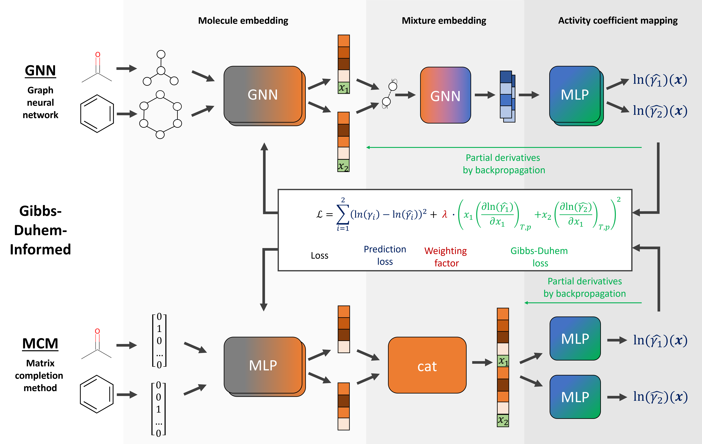
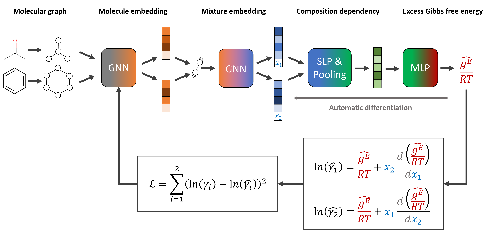

# GDI-NN

[Gibbs-Duhem-Informed Neural Networks for Binary Activity Coefficient Prediction](https://doi.org/10.1039/D3DD00103B)

## Abstract

Predicting activity coefficients of binary solvent mixtures is critical for chemical process design. GDI-NN incorporates the Gibbs-Duhem thermodynamic constraint as a physics-informed regularization term into graph neural network training, ensuring thermodynamically consistent predictions. The framework includes SolvGNN (a graph neural network for molecular interaction), SolvGNNxMLP (a hybrid GNN+MLP variant), GE-GNN (excess Gibbs free energy GNN), and MCM (Molecular Component Model using embeddings and MLPs).





## Datasets

The binary activity coefficient dataset was created by Qin et al. The dataset contains experimentally measured activity coefficients for binary solvent mixtures at various compositions.

| Dataset | Description | Count | Properties |
| :---: | :---: | :---: | :---------: |
| binary_activity | Binary solvent activity coefficients | ~5000 | ln(gamma1), ln(gamma2) |
| binary_activity_extra | Extra validation data (COSMO-RS) | ~2000 | ln(gamma1), ln(gamma2) |

The dataset files include:
- `output_binary_with_inf_all.csv`: Main training data with binary activity coefficients
- `output_binary_with_inf_all_extra.csv`: Extra validation data
- `solvent_list.csv`: List of solvents with SMILES strings
- `all_systems_comp_range_step5e-2.csv`: Composition range data

Data can be downloaded from [here](https://paddle-org.bj.bcebos.com/paddlematerial/datasets/gdinn/gdinn_data.zip).

## Model

GDI-NN provides four model architectures for binary activity coefficient prediction:

**SolvGNN**: Uses two GCN layers to extract molecular graph features from each solvent, followed by global MPNN interaction and MLP classifier. The molecular graphs are constructed from SMILES using RDKit with CanonicalAtomFeaturizer (74-dim node features).

**SolvGNNxMLP**: A variant of SolvGNN with additional MLP heads.

**GE-GNN**: Excess Gibbs free energy GNN that directly predicts the excess Gibbs free energy and derives activity coefficients from it.

**MCM (Molecular Component Model)**: Uses solvent ID embeddings combined with MLPs, without graph structure. Suitable as a baseline comparison.

All models support the Gibbs-Duhem constraint as a physics-informed loss term:

$$x_1 \frac{\partial \ln \gamma_1}{\partial x_1} + x_2 \frac{\partial \ln \gamma_2}{\partial x_1} = 0$$

## Results

| Model Name | Dataset | Property | MAE(Val / Test) | GPUs | Training time | Config | Checkpoint |
| :---: | :---: | :---: | :---: | :---: | :---: | :---: | :---: |
| solvgnn_binary_gamma | binary_activity | ln(gamma) | 0.0259 / - | 1x NVIDIA A40 | ~6h (100 epochs) | [solvgnn_binary_gamma.yaml](solvgnn_binary_gamma.yaml) | [download](https://paddle-org.bj.bcebos.com/paddlematerial/checkpoints/gdinn/solvgnn_binary_gamma.pdparams) |
| solvgnn_xmlp_binary_gamma | binary_activity | ln(gamma) | 0.0172 / - | 1x NVIDIA A40 | ~7h (100 epochs) | [solvgnn_xmlp_binary_gamma.yaml](solvgnn_xmlp_binary_gamma.yaml) | [download](https://paddle-org.bj.bcebos.com/paddlematerial/checkpoints/gdinn/solvgnn_xmlp_binary_gamma.pdparams) |
| gegnn_binary_gamma | binary_activity | ln(gamma) | 0.0237 / - | 1x NVIDIA A40 | ~9h (100 epochs) | [gegnn_binary_gamma.yaml](gegnn_binary_gamma.yaml) | [download](https://paddle-org.bj.bcebos.com/paddlematerial/checkpoints/gdinn/gegnn_binary_gamma.pdparams) |
| mcm_multimlp_binary_gamma | binary_activity | ln(gamma) | 0.0278 / - | 1x NVIDIA A40 | ~7h (100 epochs) | [mcm_multimlp_binary_gamma.yaml](mcm_multimlp_binary_gamma.yaml) | [download](https://paddle-org.bj.bcebos.com/paddlematerial/checkpoints/gdinn/mcm_multimlp_binary_gamma.pdparams) |

## Environment

- PaddlePaddle >= 2.5.0
- PGL >= 2.2.0
- RDKit
- pandas
- numpy
- scikit-learn

Install dependencies:
```bash
pip install paddlepaddle pgl rdkit-pypi pandas scikit-learn
```

## Data Preparation

Download the dataset and place it under `ppmat/datasets/gdinn_data/`:
```bash
wget https://paddle-org.bj.bcebos.com/paddlematerial/datasets/gdinn/gdinn_data.zip
unzip gdinn_data.zip -d ppmat/datasets/gdinn_data/
```

Or the dataset will be automatically downloaded when initializing `BinaryActivityDataset`.

## Training

```bash
# SolvGNN
python property_prediction/train.py -c property_prediction/configs/gdinn/solvgnn_binary_gamma.yaml

# SolvGNNxMLP
python property_prediction/train.py -c property_prediction/configs/gdinn/solvgnn_xmlp_binary_gamma.yaml

# GE-GNN
python property_prediction/train.py -c property_prediction/configs/gdinn/gegnn_binary_gamma.yaml

# MCM MultiMLP
python property_prediction/train.py -c property_prediction/configs/gdinn/mcm_multimlp_binary_gamma.yaml

# Multi-GPU training
python -m paddle.distributed.launch --gpus="0,1" property_prediction/train.py -c property_prediction/configs/gdinn/solvgnn_binary_gamma.yaml
```

## Validation

```bash
python property_prediction/train.py \
    -c property_prediction/configs/gdinn/solvgnn_binary_gamma.yaml \
    Global.do_train=False \
    Global.do_eval=True \
    Global.do_test=False \
    Trainer.pretrained_model_path=output/solvgnn_binary_gamma/checkpoints
```

## Testing

```bash
python property_prediction/train.py \
    -c property_prediction/configs/gdinn/solvgnn_binary_gamma.yaml \
    Global.do_train=False \
    Global.do_test=True \
    Global.do_eval=False \
    Trainer.pretrained_model_path=output/solvgnn_binary_gamma/checkpoints
```

## Key Configuration

| Parameter | Description | Default |
| :---: | :---: | :---: |
| Model.__class_name__ | Model architecture | SolvGNNBinary |
| Model.__init_params__.in_dim | Node feature dimension | 75 |
| Model.__init_params__.hidden_dim | Hidden layer dimension | 256 |
| Model.__init_params__.pinn_lambda | Gibbs-Duhem constraint weight | 1.0 |
| Loss.__class_name__ | Loss function | GibbsDuhemLoss |
| Dataset.train.dataset.__class_name__ | Dataset class | BinaryActivityDataset |

## Citation

```
@article{Rittig2023_GDI,
  doi = {10.1039/D3DD00103B},
  url = {https://doi.org/10.1039/D3DD00103B},
  author = {Rittig, Jan G. and Felton, Kobi C. and Lapkin, Alexei A. and Mitsos, Alexander},
  title = {{G}ibbs-{D}uhem-Informed Neural Networks for Binary Activity Coefficient Prediction},
  publisher = {Royal Society of Chemistry ({RSC})},
  year = {2023},
  volume = {2},
  issue = {6},
  pages = {1752--1767},
  journal = {Digital Discovery}
}
```

```
@misc{Rittig2024_TCGNN,
  author = {Rittig, Jan G. and Mitsos, Alexander},
  title = {Thermodynamics-Consistent Graph Neural Networks},
  year = {2024},
  howpublished = {arXiv preprint},
}
```
